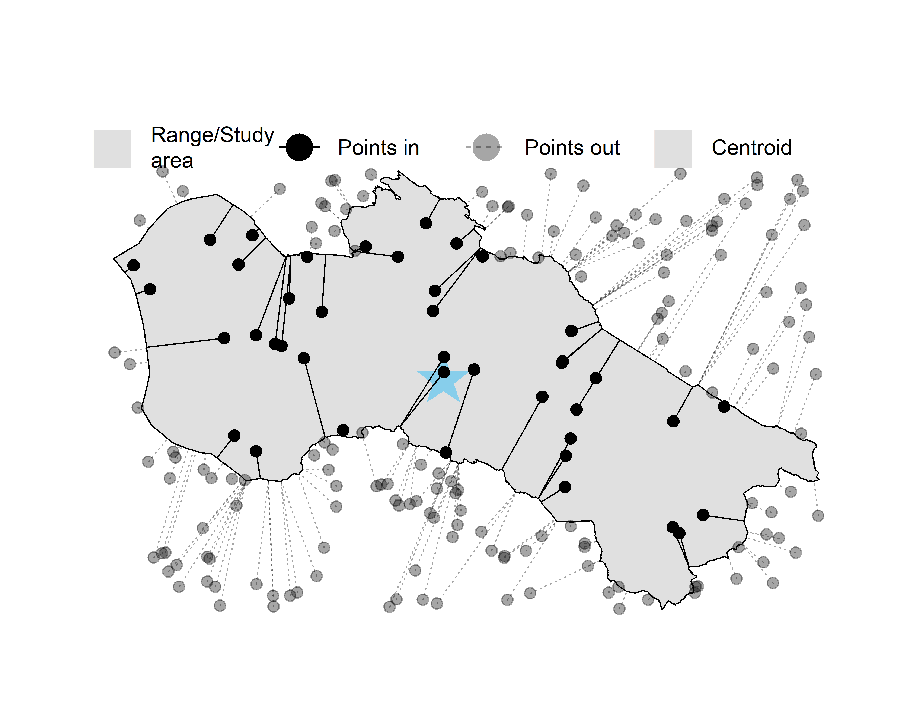
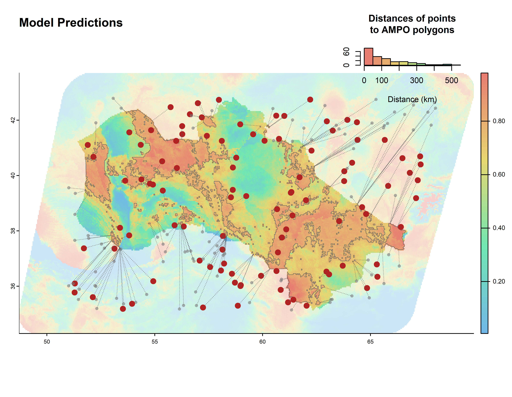

# Disease-prevalence-NicheCentralityTheory
# Introduction (needs to be edited)
Species population parameters such as densities and population connectivity can greatly impact the transmission and prevalence of infectious diseases and parasites. Although precise accounts of species ranges and distribution data exist (e.g IUCN Red-List and Gbif databases), population and habitat use data are scarcer. This makes the study of the relationship between species population dynamics and infection disease prevalence challenging. However, some authors have proposed that species habitat quality and distance to range can impact species abundance and fitness. This is usually termed as the niche Centrality Hypothesis or NCH, which postulates that species should be more efficient when they occur in optimal environments than when they grow in marginal conditions or sub-optimal habitats.  

In this project, we are going to use the principles of the NCH to explore the relationships between infectious diseases and species' optimal/marginal habitats. Under the NCH assumptions we can potentially describe two different scenarios of infectious disease-species habitat relationships: In the first scenario, species abundances have a positive effect on the transmission and prevalence of the infectious disease across the population, therefore we are going to detect more positive cases towards de areas where the habitat is optimal for the species. In a second scenario, the lower fitness of species makes them more susceptive to infection and therefore most positive cases are going to be detected in sub-optimal or marginal habitats.  We are going to explore these possibilities using two different approaches: 
### 1.a Records distance to species range perimeter and centroid
Simple calculation of the minimum distance of a presence or disease occurrence point to the known range of the species (Figure

### 1.b Habitat suitability and area of maximum probability of occurrence (AMPO)
Based on the modelling of the species habitat, this method will first build a Species Distribution Model using all the available spatial information for the species. Then, the SDM model will be trim based on the maximum performance of the [Kappa]() parameter and the resulting areas will be used as references within and outside the known range of the species 

# Scripts (update)
- 0. DUummyData.R: Prepares some random spatial data to test functions and set the format for the species spatial data.
- 1. RangeAnalysis.R: Using the prepared data, performs the spatial analysis to extract the range and niche distance for a set of species presence data.
- ./trapping_data_scripts/0.0 filter_raw_data.R: Collates trapping data from the extraction sheets in ./Data/raw_trapping_data and filters to keep only studies with site resolution <1km. Outputs to raw_trapping_data/trapping_data_NC.rds.
- ./trapping_data_scripts/0.1 reshape_trapping_data.R: Reshapes the filtered raw data to the desired shape. Keeps only species in top 20 for number of unique sites. outputs to clean_site_data.rds.
- ./trapping_data_scripts/1.0 visualise_trapping_data.R: Makes some plots visualising the dataset (clean_site_data.rds). Plots are outputted in ./Results/Figures/.
# Functions
- distance_ranges.R: Calculates the distance of points to the perimeter and centroid of a given polygon.
- distance_p_points (included into distance_ranges.R): Calculate the minimum distance of points to polygons.
- Pred_to_polygons.R: Takes an SDM model prediction and transform these predictions into polygons within an outside a species range.
- rast_harmonization.R: given a list of raster routes, it performs a spatial harmonization to use the data for the SDM analysis. 

# Tasks
- Split the range analysis script into geographic distance metrics and environmental multidimensional metrics.
- Load the ArHa data directly from the directory to keep a better track of data updates and changes.
- Include the habitat/niche distance metrics in the ArHa dataset to include all the information that might be of interest for the prevalence analysis.
- Clean up the repository to remove unwanted scripts/folders/data
